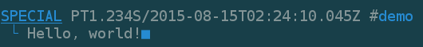

so.log
======

Add [CSI-SGR] colorized prefixes to each line of log.
For easy to distinguish and read in text terminal.


API
---

### Writing Log

See [log.hpp](include/log.hpp).

- Step 1: Streaming log text to a `so::log` object. E.g.

  ```cpp
  so::log log{so::log_label::special};
  log << "Hello, ";
  // ...
  std::this_thread::sleep_for(std::chrono::milliseconds{1234});
  // ...
  log << "world!";
  ```

  > **Under The Hood!**
  > `so::log` is publicly derived from `std::ostringstream`.

- Step 2: Optionally, adding tags for better classification.

  ```cpp
  void  so::log::assign(std::string tag);
  void  so::log::revoke(std::string tag);
  void  so::log::clear_tags();
  ```

  E.g.
  ```cpp
  log.assign("demo");
  ```

- Step 3: Streaming the `so::log` object to the target stream.

  ```cpp
  std::ostream& operator<<(std::ostream&, so::log);
  ```

  E.g.
  ```cpp
  std::cerr << log;
  ```
  > 

> **Tip!**
> By using 2 stream objects, you avoid interlaced text (*in multi-threading*)
> from constructing complex log, as it may not be an atomic operation.

### Filtering Log

See [log_filter.hpp](include/log_filter.hpp).

There are 2 factors can be used to control whether a `so::log` object really
put its content into the other `std::ostream`.

- The `so::log_label` enumeration, which is implemented as `unsigned` integer.

  Once specified a max value

  ```cpp
  static
  void  so::log_filter::latch(so::log_label);
  ```

  any log constructed with a **greater** value will be blocked.

- Tags.

  By specifying a set of tags

  ```cpp
  static
  void  so::log_filter::append(std::string);
  static
  void  so::log_filter::remove(std::string);
  ```

  you can

  - block any log, unless it has a specified tag;

    ```cpp
    static
    void  so::log_filter::on();
    ```

  - or only block a log which has any specified tag.

    ```cpp
    static
    void  so::log_filter::off();
    ```

> **Tip!**
> The default setting wont block any log.

#### Set In One Call

```cpp
static
void  so::log_filter::configure(std::string);
```

The string should be formatted as

```ebnf
(* EBNF *) [ latch ] [ ( "+" | "-" ) tag { "," tag } ]
```

E.g.
```
verbose+demo,fun
```

- `latch` can be

  - Literal name of any presented `so::log_label`.
    Either UPPERCASE or lowercase, but not mixed. Fragment is also possible.

    E.g. `FAILURE`, `WARN`, `caution`, etc.

  - Numeric (*determined by `std::strtoul()`*)
    that would be casted to `so::log_label`.

- `+` will trigger `so::log_filter::on()`, while `-` will be `off()`.

#### Deferred Filtering

```sh
$ tail -f my.log | awk '/demo/,/■/'
```

> **Tip!**
> `■` is a [unicode black square][U+25A0].


License
-------
![LGPLv3]

Copyright (C) 2015  Iceberg YOUNG

This program is free software: you can redistribute it and/or modify it
under the terms of the GNU Lesser General Public License as published by
the Free Software Foundation, either version 3 of the License, or
(at your option) any later version.

This program is distributed in the hope that it will be useful,
but WITHOUT ANY WARRANTY; without even the implied warranty of
MERCHANTABILITY or FITNESS FOR A PARTICULAR PURPOSE.  See the
GNU Lesser General Public License for more details.

You should have received a copy of the GNU Lesser General Public License
along with this program.  If not, see <http://www.gnu.org/licenses/>.


---

[CSI-SGR]: https://en.wikipedia.org/wiki/ANSI_escape_code#CSI_codes
"SGR (Select Graphic Rendition) Parameters"

[U+25A0]: http://www.fileformat.info/info/unicode/char/25a0/index.htm
"Unicode Character 'BLACK SQUARE' (U+25A0)"

[LGPLv3]: http://www.gnu.org/graphics/lgplv3-88x31.png
"GNU Lesser General Public License version 3"
